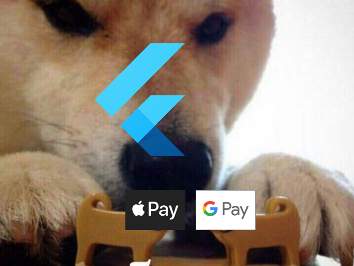

## Google Pay Preparing

#### TODO

See Android [documentation](https://developers.google.com/pay/api/android/overview)

## Apple Pay Preparing

#### TODO

See Apple [documentation](https://developer.apple.com/documentation/passkit/apple_pay/setting_up_apple_pay_requirements)

## Usage

Firstly, you need to make sure, that Pay api is available on device: 
```dart
import 'package:flutter_pay/flutter_pay.dart';
//..

FlutterPay flutterPay = FlutterPay();

bool isAvailable = await flutterPay.canMakePayments();
/..
```

If you need to check if user has at least one active card: 
```dart
import 'package:flutter_pay/flutter_pay.dart';
//..

FlutterPay flutterPay = FlutterPay();

bool isAvailable = await flutterPay.canMakePaymentsWithActiveCard();

//Also you can state allowed payment card networks:
bool isAvailable = await flutterPay.canMakePaymentsWithActiveCard(
	allowedPaymentNetworks: [
		PaymentNetwork.visa, 
		PaymentNetwork.masterCard,
	],
);
```

To make payment is ```requestPayment``` method. This function will return to you token that you need to send to your gateway to complete payment.
Example: 
```dart
import 'package:flutter_pay/flutter_pay.dart';

PaymentItem item = PaymentItem(name: "T-Shirt", price: 2.98);

FlutterPay flutterPay = FlutterPay();

flutterPay.setEnvironment(environment: PaymentEnvironment.Test);

String token = await flutterPay.requestPayment(
      googleParameters: GoogleParameters(
        gatewayName: "example",
        gatewayMerchantId: "example_id",
		merchantId: "example_merchant_id",
		merchantName: "exampleMerchantName",
      ),
      appleParameters:
          AppleParameters(merchantIdentifier: "merchant.flutterpay.example"),
      currencyCode: "USD",
      countryCode: "US",
      paymentItems: items,
    );
```

Note that some arguments affects only Apple Pay or Google Pay. For example, **paymentItems** affects only Apple Pay. And the last item is used for grand total label. 

**merchantName** affects only Google Pay and will be shown to user. 

**gatewayName** also affects only Google Pay. See Google Pay integration section.

## Payment Network matrix

| Payment Network   | iOS | Android |
|-------------------|-----|---------|
| Visa              | +   | +       |
| MasterCard        | +   | +       |
| American Express  | +   | +       |
| Interac           | +   | +       |
| Discover          | +   | +       |
| JCB               | +   | +       |
| Maestro           | +   |         |
| Electron          | +   |         |
| Cartes Bancarries | +   |         |
| Union Pay         | +   |         |
| EftPos            | +   |         |
| Elo               | +   |         |
| ID Credit         | +   |         |
| Mada              | +   |         |
| Private Label     | +   |         |
| Quic Pay          | +   |         |
| Suica             | +   |         |
| V Pay             | +   |         |

## Roadmap

- [x] Basic implementation
- [ ] Complete docs
- [ ] Add merchant capabilities support
- [ ] Add billing and shipping info support

